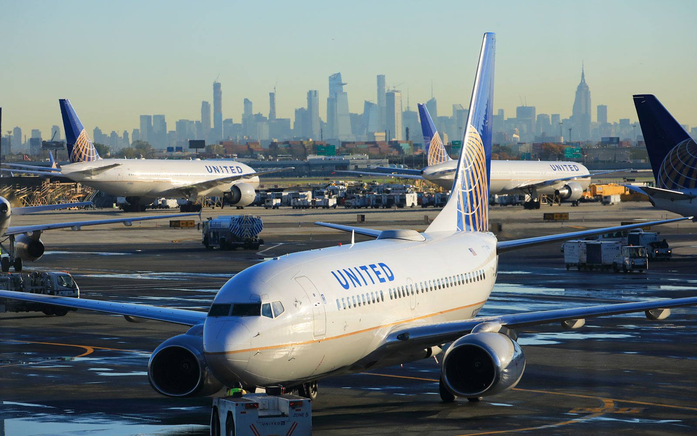

# Flight delays at Newark Airport

### List of key files:
1. Main Jupyter notebook : **flight_delay_notebook.ipynb**
2. Formulas Jupyter notebook :  **library.py**
3. Presentation in <a href="https://docs.google.com/presentation/d/1t2DY1rbv1-DBIsj7A76iKW4GZFG_0Hob4WD-7mGCARg/">Google Slides</a> format
4. Presentation in PDF: **Presentation_slides.pdf**

### Other files:
5. Saved trained models in Pickle : **/pickle folder**
6. Main airline delay data: **newark_flights.csv**
5. Weather API data import Jupyter notebook: **dark_sky.ipynb**
6. Aircraft data import Jupyter notebook: **plane_registration.ipynb**

Further details on ReadMe will be updated on Wed 5/2/2020

